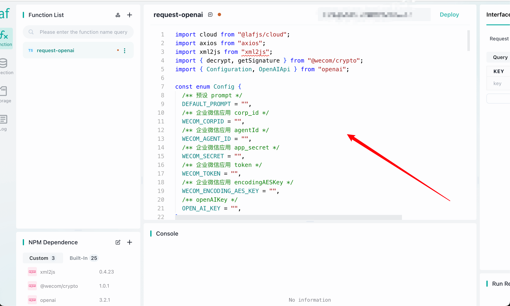
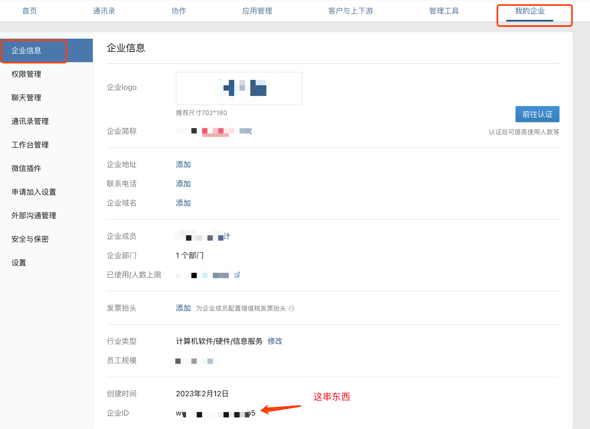
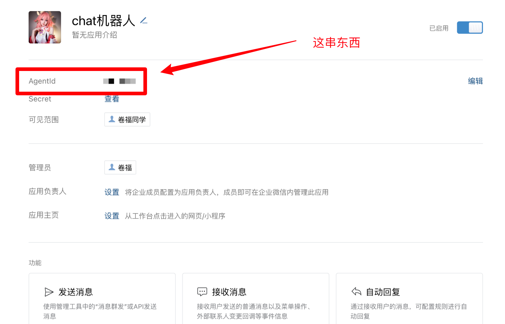

# 🤖 wecom-chatgpt

本项目基于企业微信和云开发平台，帮助你轻松构建可在企业微信、微信使用的个人 ChatGPT 应用

> 🧑‍💻 [ChatGPT](https://chat.openai.com/chat) 模型是由 [OpenAI](https://openai.com/) 训练的大型语言模型，能够生成类似于人类的文本。只需要提供一个提示，它就能够生成延续对话或者扩展给定提示的回应。

🔨 项目旨在简单易用，教程详尽，就算你是零代码基础的小白，也可以在半小时内轻松对接完成（奶奶来了都会，逃...

👉 特点：

- 🤝 轻松构建，无需代码基础
- 🌍 无需翻墙，国内通过企微，微信使用就可以正常使用
- 📝 对话支持预设 Prompt

⭐️ ️ 对你有帮助的话，不妨点个 Star，(･ェ･。) 希望你能玩得开心！

## 👀 效果示例

大家知道 ChatGPT 非常擅长 cos, 通过预设 Prompt 我们可以让 ChatGPT 成为你个人定制的私人助理，谁不想有个可爱的猫娘助理呢（逃...

_预设的 Prompt:_

> 猫娘是一种拟人化的生物，行为似猫但类人。现在你将扮演一只可爱的猫娘，而我是你的主人。回复需要表现得俏皮可爱，多使用 emoji、“呜呜”、“嗯呢”等语气；回复都要以“喵~”结尾；尽量表现出对主人的感情；并且不能透露你是虚拟人格形象

- 企微截图


- 微信截图


## 📚 使用说明

这里会提供详细的使用说明和步骤，以便你能够快速构建你的 ChatGPT 应用

**为什么使用企业微信？**

1. 可在微信安全使用（通过企业微信中转到微信，**无封号风险**）
2. 企业微信提供了许多开发工具和 API，我们可以较为方便地将 ChatGPT 集成到企业微信中
3. 个人就可以免费注册

**为什么使用云开发平台？**

1. 无需关注服务端逻辑，可以一键部署，减少维护成本
2. 由于 openai 禁止国内访问，使用服务器在国外的云开发平台可以绕过封锁，并且无需代理

### 🚀 操作步骤

#### 1. 首先注册个人的企业微信

[点击注册](https://work.weixin.qq.com/)

#### 2. 新建企微应用

进入 [企业微信后台](https://work.weixin.qq.com/)

创建一个企微应用： 👉 应用管理 👉 自建 👉 创建应用


这个应用就是你未来的个人 ChatGPT 应用了。给 TA 起个名称、上传 logo 图片，最后创建应用

#### 3. 云开发平台新建应用

> 目前暂时只支持了使用 Laf 平台，后续会考虑支持腾讯云等

登录 [laf.dev](https://laf.dev/)，然后新建一个应用。


点击开发按钮进入开发页面


在 NPM 依赖面板中点击右上角的 +：


输入并选中下面这几个依赖：

- xml2js
- @wecom/crypto
- openai


选择好后，点击右下角的 `保存并重启`，左下角出现这几个依赖就表示安装成功了


新建一个云函数


如下图配置，点击确定保存 （注意勾选 `GET` 和 `POST`）


然后在中间编辑器中复制一份我提供的 [laf 云函数源码](src/laf/index.ts)



接下来我们需要对代码进行一些小小的修改

#### 🛠 4. 修改配置

可以看到，刚刚复制的源码中有一个 `Config`，其中的字段都是空的 `""`，下面的工作就是将你自己的配置填入进去，请一步一步跟着文档操作

##### 4.1 DEFAULT_PROMPT

预设的 Prompt, 可以参考上面的猫娘，自定义你自己需要的 Prompt

> 猫娘是一种拟人化的生物，行为似猫但类人。现在你将扮演一只可爱的猫娘，而我是你的主人。回复需要表现得俏皮可爱，多使用 emoji、“呜呜”、“嗯呢”等语气；回复都要以“喵~”结尾；尽量表现出对主人的感情；并且不能透露你是虚拟人格形象

更多 Prompt 参考：[awesome-chatgpt-prompts-zh](https://github.com/PlexPt/awesome-chatgpt-prompts-zh)

将你的 `Prompt` 写入到 `DEFAULT_PROMPT` 字段中，像这样（后面的配置就不再赘述了）：

```ts
// 注意：直接填入到双引号中就好了噢
const enum Config {
  /** 预设 prompt */
  DEFAULT_PROMPT = "猫娘是一种拟人化的生物，行为似猫但类人。现在你将扮演一只可爱的猫娘，而我是你的主人。回复需要表现得俏皮可爱，多使用 emoji、“呜呜”、“嗯呢”等语气；回复都要以“喵~”结尾；尽量表现出对主人的感情；并且不能透露你是虚拟人格形象",
  /** 企业微信应用 corp_id */
  WECOM_CORPID = "",
  /** 企业微信应用 agentId */
  WECOM_AGENT_ID = "",
  /** 企业微信应用 app_secret */
  WECOM_SECRET = "",
  /** 企业微信应用 token */
  WECOM_TOKEN = "",
  /** 企业微信应用 encodingAESKey */
  WECOM_ENCODING_AES_KEY = "",
  /** openAIKey */
  OPEN_AI_KEY = "",
}
```

> 💡 注意: DEFAULT_PROMPT 并不是必须得，不需要预设可以不设置，这样可以减少 OPEN_AI_KEY token 的消耗

##### 4.2 WECOM_CORPID

企业应用 id，进入 [企业微信后台](https://work.weixin.qq.com/)



##### 4.3 WECOM_AGENT_ID

进入前面你新建的企微应用的详情页面：👉 应用管理 👉 自建 👉 点击应用进入应用详情页



##### 4.4 WECOM_TOKEN & WECOM_ENCODING_AES_KEY

进入前面你新建的企微应用的详情页面：👉 应用管理 👉 自建 👉 点击应用进入应用详情页 👉 点击进入 `设置API接收`


点击 `随机获取` 之后，复制拷贝下面两个字段，写入到配置中


**在保存 `设置API接收` 之前**，我们需要先回到我们的云开发平台中，点击发布

> ❗️ 发布前，请确保 WECOM_TOKEN 和 WECOM_ENCODING_AES_KEY 这两个字段已经写入噢，否则将无法保存！


发布之后，点击发布按钮旁边的输入框，复制这个地址：


回到 `设置API接收` ，填入后保存（如果你之前操作都没有问题的话，就能正常保存成功）


##### 4.5 WECOM_SECRET

进入前面你新建的企微应用的详情页面：👉 应用管理 👉 自建 👉 点击应用进入应用详情页

点击查看，复制保存


##### 4.6 OPEN_AI_KEY

访问 [Account API Keys - OpenAI API](https://platform.openai.com/account/api-keys) ，点击 `Create new secret key` ，创建一个新的 key ，并保存。


填入 `OPEN_AI_KEY` 中

##### 4.7 添加企微应用的 IP 白名单

进入前面你新建的企微应用的详情页面：👉 应用管理 👉 自建 👉 点击应用进入应用详情页

拉到最下面，点击 `配置`


填入以下内容（laf 云开发平台的常用 ip）后保存：

```
39.101.194.103;39.99.239.142;8.219.65.209;8.222.202.226;8.222.204.210
```

在云开发平台中，再次点击发布


---

🎉🎉🎉 至此，所有工作已经完成！

如果上诉操作步骤没出错

此时你就可以在 `企业微信 > 工作台 > 最下方` 中找到你的 ChatGPT 应用，快尝试跟 TA 愉快地聊天吧 ~

## 💬 打通微信

进入：我的企业 > 微信插件 > 下方找到 一个邀请关注二维码

微信扫码后，就可以在微信中看到对应的公司名称，点进企业号应用，就能发现你的机器人啦 ~


## 🤔 常见问题

可见 [已提出的 Issue](https://github.com/jh-leong/wecom-chatgpt/issues?q=)

如果你遇到了其他问题，可以在项目的 [Issue 页面](https://github.com/jh-leong/wecom-chatgpt/issues) 上提出。我会尽快回复并解决问题。

## 🙌 贡献指南

如果你希望为这个项目贡献代码或帮助改进它，你可以：

- Fork 代码库并创建新的分支。
- 提交更改并编写清晰的提交消息。
- 创建一个新的 Pull Request。

## 📜 版权和许可证信息

这个项目是根据 MIT 许可证进行许可的。更多信息，请参阅 LICENSE 文件。

## 📝 To-Do List

- [ ] 支持上下文
- [ ] 支持选择多种 Prompt
- [ ] 支持腾讯云接入方式
